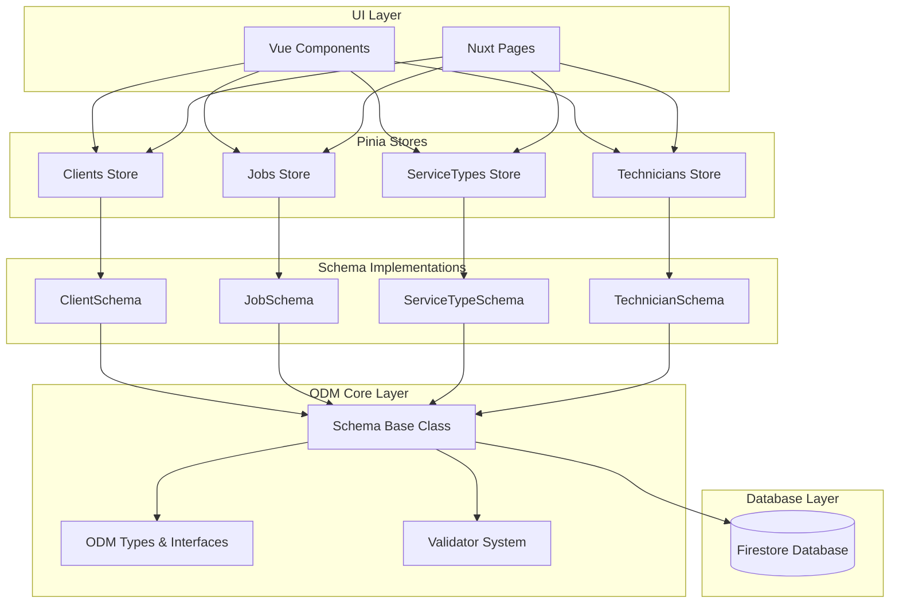
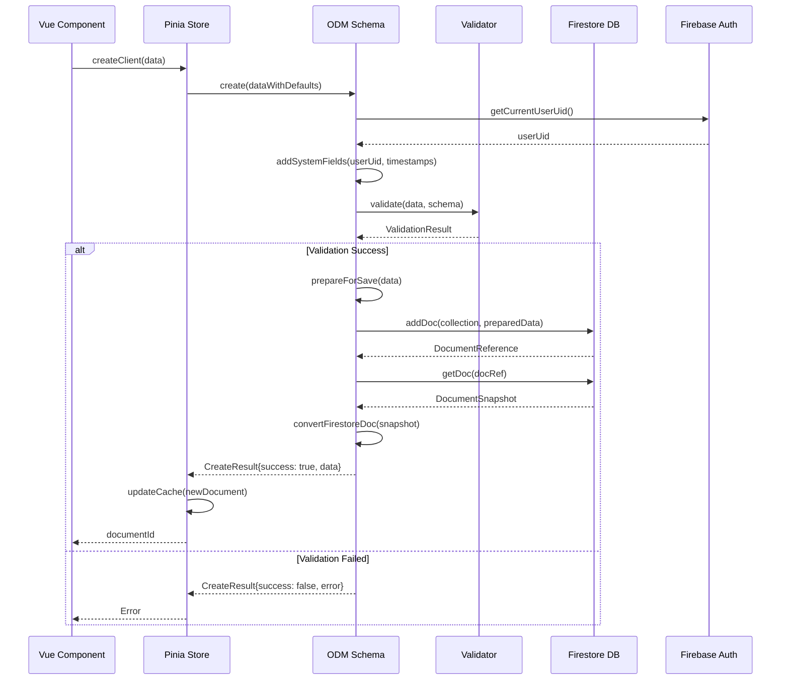
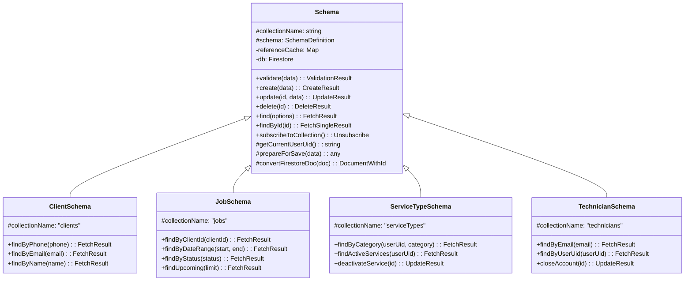
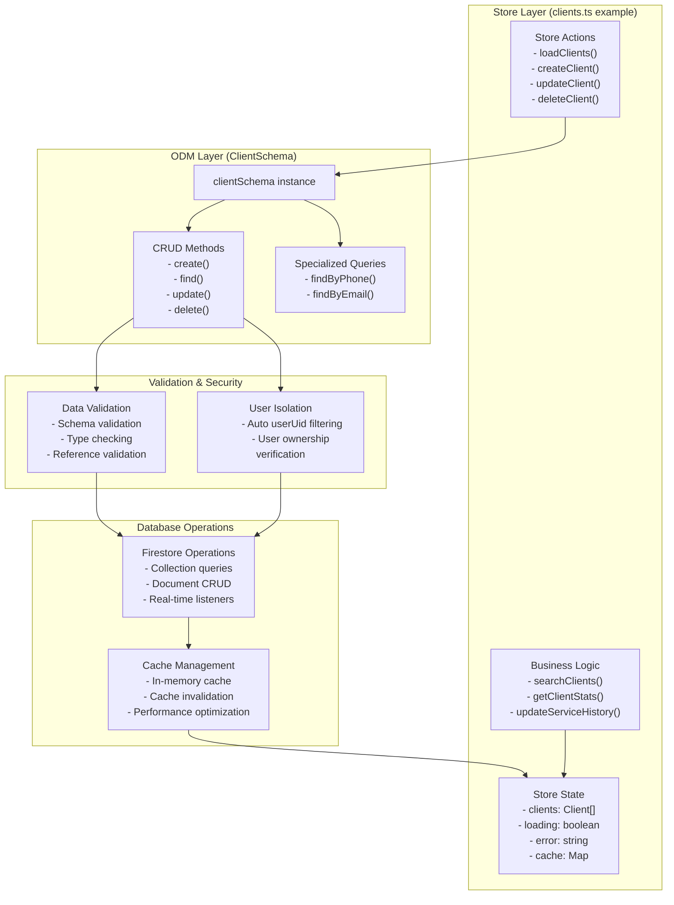
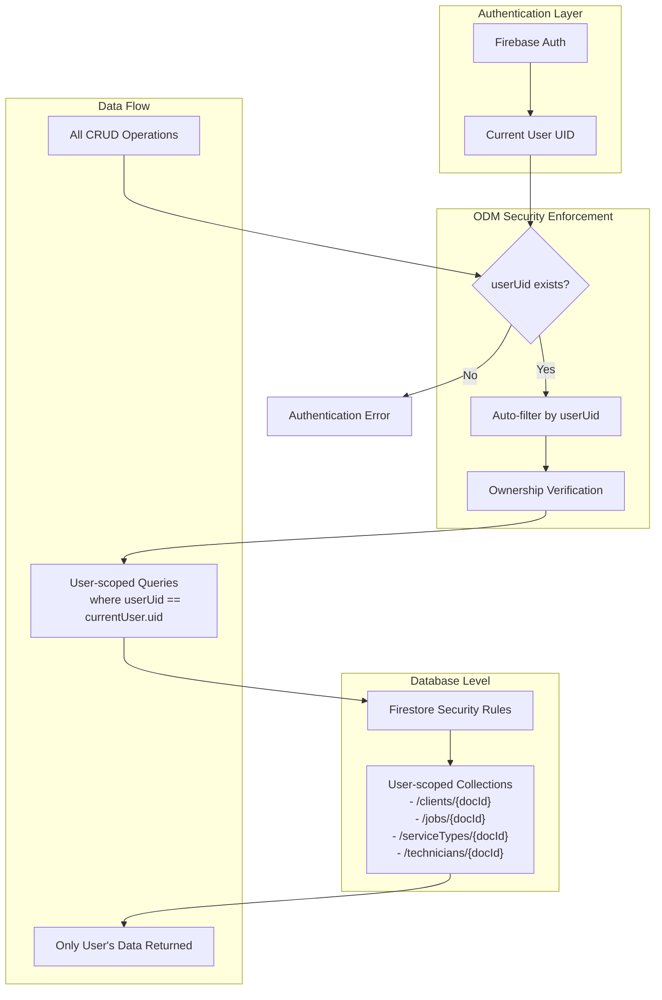
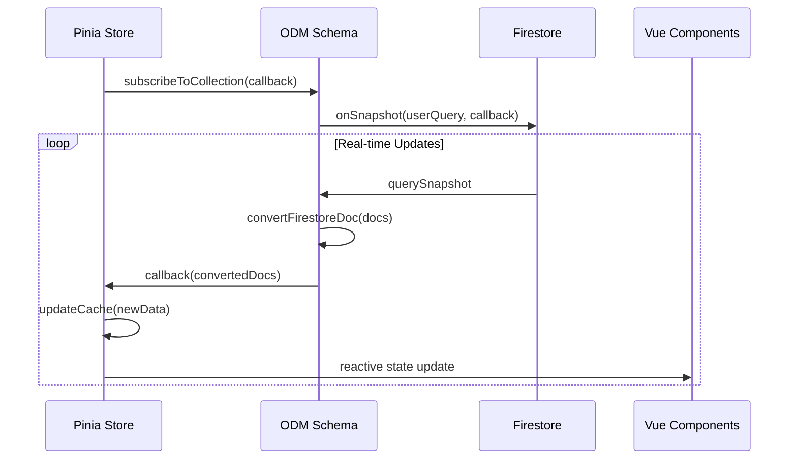

# InstalarPro ODM (Object Document Mapper) Architecture

## Overview

The InstalarPro ODM system provides a robust, type-safe layer between the Pinia stores and Firestore database. It handles validation, user isolation, caching, and provides a consistent API for data operations across all entities.

### Key Design Principles

1. **User Isolation**: All data is automatically scoped to the authenticated user via `userUid` field
2. **Type Safety**: Full TypeScript support with runtime validation
3. **Schema-First**: All data structures defined through schemas with validation rules
4. **Caching**: In-memory caching for performance optimization
5. **Real-time**: Firestore real-time subscriptions for live data updates
6. **Security**: Built-in reference validation and user ownership verification

## Core ODM Architecture



## Data Flow Architecture



## Schema Inheritance Structure



## Store-ODM Integration Pattern



## User Isolation Security Model



## Core Components Deep Dive

### Base Schema Class (`utils/odm/schema.ts`)

The foundation of the ODM system, providing:

**Core Functionality:**
- **User Authentication Integration**: Automatic `userUid` injection and verification
- **Data Validation**: Schema-based validation using the Validator system
- **Firestore Operations**: CRUD operations with automatic user scoping
- **Real-time Subscriptions**: Live data updates via Firestore listeners
- **Reference Validation**: Cross-document reference integrity checking
- **Timestamp Management**: Automatic creation and update timestamps

**Key Methods:**
- `create(data)`: Creates new documents with validation and user scoping
- `update(id, data)`: Updates existing documents with ownership verification
- `delete(id)`: Deletes documents with ownership verification
- `find(options)`: Queries documents with automatic user filtering
- `subscribeToCollection()`: Sets up real-time data synchronization

### Validator System (`utils/odm/validator.ts`)

Provides comprehensive data validation:

**Validation Types:**
- `string`: Length, pattern, required validation
- `number`: Range validation (min/max)
- `boolean`: Type validation
- `date`: Date object, dayjs, Firestore timestamp validation
- `array`: Array validation with element type checking
- `object`: Object structure validation
- `reference`: Document reference validation

**Features:**
- Field-level validation with detailed error messages
- Default value application
- Nested validation for complex data structures

### Schema Definitions

#### ClientSchema (`utils/odm/schemas/clientSchema.ts`)
```typescript
// Key fields: name, phone, address, email, serviceHistory, totalJobs, totalSpent
// Specialized methods: findByPhone(), findByEmail(), findByName()
```

#### JobSchema (`utils/odm/schemas/jobSchema.ts`)
```typescript
// Key fields: clientId, clientName, serviceType, scheduledDate, status, price
// Specialized methods: findByClientId(), findByDateRange(), findByStatus()
```

#### ServiceTypeSchema (`utils/odm/schemas/serviceTypeSchema.ts`)
```typescript
// Key fields: name, description, basePrice, estimatedDuration, category
// Specialized methods: findByCategory(), findActiveServices(), deactivateService()
```

#### TechnicianSchema (`utils/odm/schemas/technicianSchema.ts`)
```typescript
// Key fields: name, phone, email, secondaryEmail, isActive
// Specialized methods: findByEmail(), findByUserUid(), closeAccount()
```

## Store Integration Patterns

### Standard Store Structure

All stores follow a consistent pattern:

```typescript
export const useEntityStore = defineStore('entity', () => {
  // Schema instance
  const entitySchema = new EntitySchema()
  
  // Reactive state
  const entities = ref<Entity[]>([])
  const loading = ref<boolean>(false)
  const error = ref<string | null>(null)
  
  // Cache management
  const entitiesCache = new Map<string, Entity>()
  
  // CRUD operations using schema
  const createEntity = async (data: EntityCreateInput) => {
    const result = await entitySchema.create(data)
    // Update local state and cache
  }
  
  // Business logic methods
  // Real-time subscription management
  // Initialization and cleanup
})
```

### Cache Strategy

1. **In-memory Map cache** for fast lookups
2. **Reactive Vue state** for UI updates
3. **Cache invalidation** on data mutations
4. **Real-time sync** via Firestore subscriptions

### Real-time Subscriptions



## Implementation Best Practices

### 1. Data Operations
- Always use schema methods for database operations
- Let ODM handle user scoping and validation
- Use store methods for business logic
- Implement proper error handling

### 2. Performance Optimization
- Leverage in-memory caching for frequent reads
- Use real-time subscriptions for live data
- Implement proper loading states
- Batch operations when possible

### 3. Security Considerations
- Never bypass user scoping in queries
- Validate all input data through schemas
- Use reference validation for data integrity
- Implement proper authentication checks

### 4. Error Handling
- Provide user-friendly error messages
- Log detailed errors for debugging
- Handle network failures gracefully
- Implement retry mechanisms where appropriate

## File Structure Reference

```
utils/odm/
├── schema.ts              # Base Schema class
├── types.ts              # TypeScript interfaces and types
├── validator.ts          # Validation system
└── schemas/
    ├── clientSchema.ts   # Client entity schema
    ├── jobSchema.ts      # Job entity schema
    ├── serviceTypeSchema.ts # Service type entity schema
    └── technicianSchema.ts  # Technician entity schema

stores/
├── auth.ts               # Authentication store
├── clients.ts           # Clients store (uses ClientSchema)
├── jobs.ts              # Jobs store (uses JobSchema)
├── serviceTypes.ts      # Service types store (uses ServiceTypeSchema)
└── technicians.ts       # Technicians store (uses TechnicianSchema)
```

## Usage Examples

### Creating a New Client
```typescript
// In a Vue component
const clientsStore = useClientsStore()

const newClient = await clientsStore.createClient({
  name: 'Juan Pérez',
  phone: '+54 11 1234-5678',
  address: 'Av. Corrientes 1234, Buenos Aires',
  email: 'juan@email.com'
})
// ODM automatically adds userUid, timestamps, and validates data
```

### Querying Jobs by Date Range
```typescript
const jobsStore = useJobsStore()

const weekJobs = jobsStore.getJobsByDateRange(
  '2024-01-01',
  '2024-01-07'
)
// Automatically filtered by current user's userUid
```

### Real-time Subscription
```typescript
// Store automatically subscribes to real-time updates
const jobsStore = useJobsStore()
await jobsStore.initialize() // Sets up real-time subscription

// UI components automatically react to data changes
const upcomingJobs = computed(() => jobsStore.upcomingJobs)
```

This ODM architecture provides a robust foundation for data management in InstalarPro, ensuring type safety, security, and performance while maintaining clean separation of concerns between business logic and data persistence.