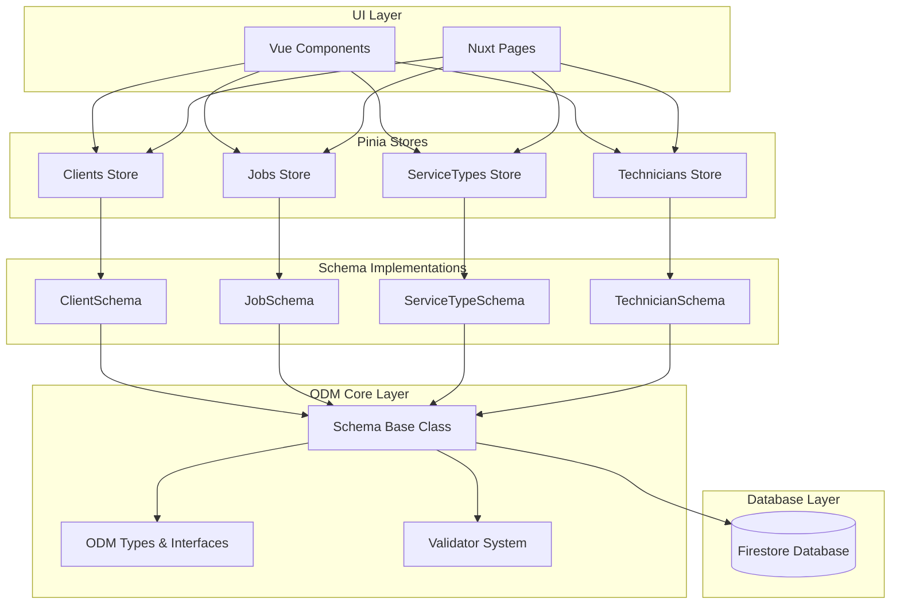
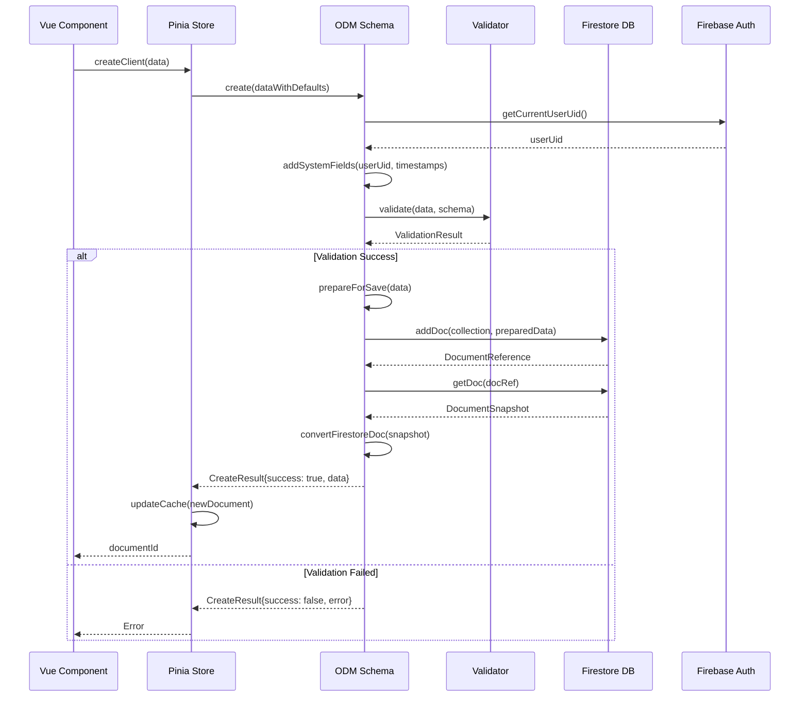

# InstalarPro ODM (Object Document Mapper) Architecture

## Overview

The InstalarPro ODM system provides a robust, type-safe layer between the Pinia stores and Firestore database. It handles validation, user isolation, caching, and provides a consistent API for data operations across all entities.

### Key Design Principles

1. **User Isolation**: All data is automatically scoped to the authenticated user via `userUid` field
2. **Type Safety**: Full TypeScript support with runtime validation
3. **Schema-First**: All data structures defined through schemas with validation rules
4. **Caching**: In-memory caching for performance optimization
5. **Real-time**: Firestore real-time subscriptions for live data updates
6. **Security**: Built-in reference validation and user ownership verification

## Core ODM Architecture



## Data Flow Architecture



## Database Structure

InstalarPro uses a flat Firestore collection structure with user isolation through `userUid` field. All collections are multi-tenant, with each document scoped to the authenticated technician.

```
// ----------- TECHNICIANS -------------
- Technician profile and account configuration
- One record per authenticated user (userUid matches Firebase Auth UID)

technicians/{technicianId}
  userUid                       // Firebase Auth UID
  name
  phone
  email
  secondaryEmail (optional)
  businessName (optional)
  urlSlug (optional)            // For agenda.instalapro.com/{urlSlug}
  isActive
  createdAt
  updatedAt
  createdBy
  archivedAt (optional)
  deactivatedAt (optional)


// ----------- SERVICE TYPES -------------
- Service catalog configuration
- Defines services offered by technician with pricing and duration

serviceTypes/{serviceTypeId}
  userUid                       // Owner technician
  name
  description (optional)
  basePrice
  estimatedDuration             // Minutes (15-480)
  category                      // e.g., 'installation', 'maintenance', 'repair'
  isActive
  createdAt
  updatedAt
  createdBy


// ----------- CLIENTS -------------
- Client database for technician
- Tracks service history and contact information

clients/{clientId}
  userUid                       // Owner technician
  name
  phone
  email (optional)
  address
  totalJobs
  totalSpent
  notes (optional)
  isActive
  createdAt
  updatedAt
  createdBy
  archivedAt (optional)


// ----------- JOBS -------------
- Job/appointment management
- Can reference existing client or contain standalone client info

jobs/{jobId}
  userUid                       // Owner technician
  clientId (optional)           // Reference to clients collection
  clientName
  clientPhone
  clientEmail (optional)
  serviceType
  description (optional)
  address
  scheduledDate
  estimatedDuration             // Minutes (15-480)
  status                        // 'pending', 'confirmed', 'in_progress', 'completed', 'cancelled'
  price
  notes (optional)
  source                        // 'back_office', 'client_booking'
  isActive
  createdAt
  updatedAt
  createdBy
  archivedAt (optional)


// ----------- SLOT AVAILABILITY -------------
- Time slot availability tracking for scheduling
- Generated from technician's weekly availability configuration
- BusinessRule: When job is created/cancelled, update corresponding slot's isAvailable status

slotAvailability/{slotId}
  userUid                       // Owner technician
  date                          // YYYY-MM-DD format
  hour                          // 6-22 (6 AM - 10 PM)
  isAvailable
  isManual                      // true if manually toggled, false if auto-closed by job
  createdAt
  updatedAt


// ----------- WALLETS -------------
- Expense and cash flow tracking for technician
- Currently focused on OUTPUT (expenses) only
- Income is calculated from completed jobs
- BusinessRule: movementType field exists for future expansion but only 'outcome' is allowed in first version

wallets/{walletId}
  userUid                       // Owner technician
  clientId (optional)           // Reference to clients collection
  jobId (optional)              // Reference to jobs collection

  movementType                  // 'income' | 'outcome' (only 'outcome' allowed for now)
  amount                        // Amount (always positive)
  date                          // When expense occurred (YYYY-MM-DD format)
  category                      // Category from predefined list (not user-configurable)
  notes (optional)              // Additional context about the expense

  createdAt
  createdBy
  updatedAt
  deletedAt (optional)          // Soft delete for debugging/audit trail
```