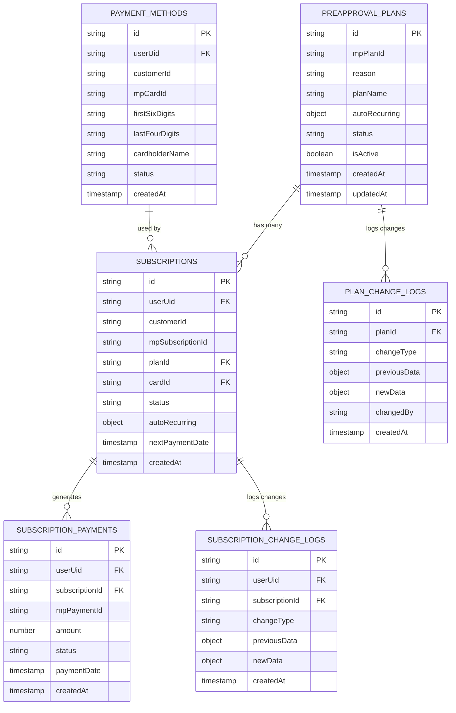
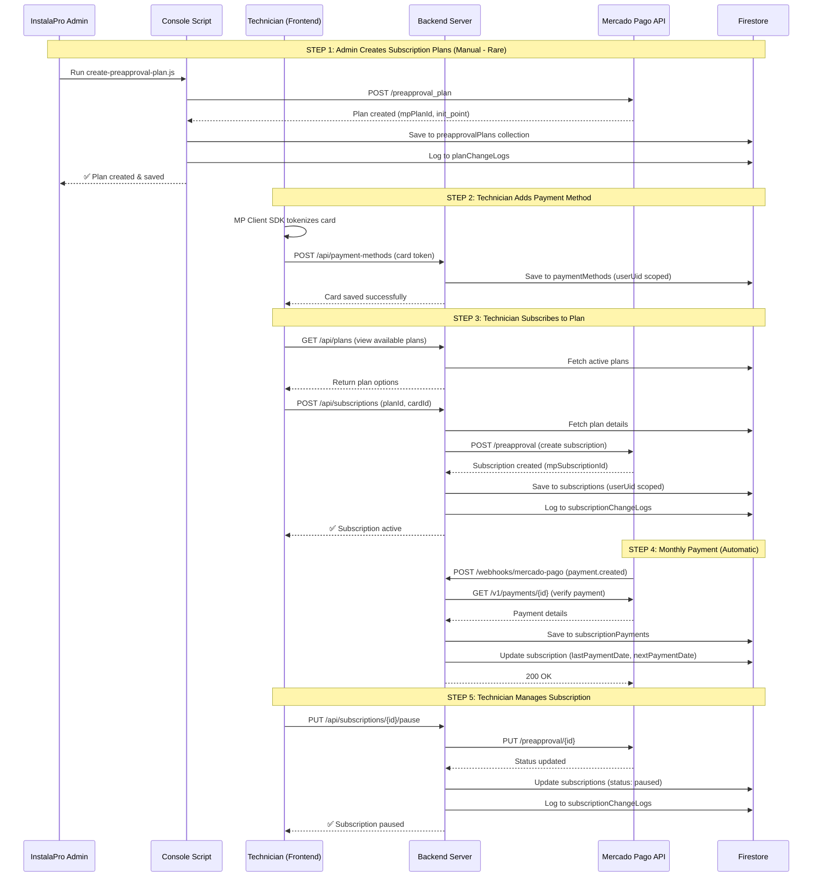

# Mercado Pago Subscription Architecture

## Overview
This document describes the architecture for the Mercado Pago subscription system in InstalaPro.

**Business Model:** Technicians subscribe to InstalaPro platform (SaaS model) and pay monthly fees via Mercado Pago.

**Plan Management:** Subscription plans are created manually by InstalaPro admins via console scripts (`/server/console/scripts/mp/`), not by individual technicians. This provides:
- Full control over pricing strategy
- Git-based audit trail for plan changes
- Simplified security (no UI for plan manipulation)
- Infrequent changes (quarterly/yearly adjustments)

---

## 1. Collections Relationship

---

## 2. Complete Subscription Flow

